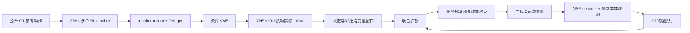

# BeyondMimic 第二、第三阶段复现准备包

编制日期：2026-10-01。项目根目录：`/home/user/Desktop/whole_body_tracking`。

**推荐主线：在当前官方仓库中增量实现独立的蒸馏与扩散模块，以论文 v4 为方法依据；第三方代码作为经过审查的模块参考。先通过 G1 仿真闭环，再扩大动作覆盖。**

用户已确认：官方 Unitree G1；从零准备动作和 teacher；本地 RTX 4070 Ti SUPER 16GB 做验证；服务器 12×RTX 4090 24GB 做正式训练。服务器地址、系统和 SSH 接入尚未提供，但不影响当前计划。

本文档包是准备与实施设计，**尚未完成 teacher 训练、VAE 训练或 diffusion 仿真复现**。后续已按用户要求补充根目录[train.sh](../../train.sh)及本地motion转换/训练/回放入口。没有安装新依赖、启动训练或改动现有虚拟环境；验证范围见08进度。

## 阅读顺序

| 文件 | 作用 | 后续模型何时读 |
|---|---|---|
| [01_证据与源码审查.md](01_证据与源码审查.md) | 论文版本、来源、当前机器、开源代码审查和可复用范围 | 开工前 |
| [02_数据与数学契约.md](02_数据与数学契约.md) | 观测、动作、潜变量、窗口、坐标、归一化和采样的确定定义 | 写接口前；所有训练前 |
| [03_分阶段实施计划.md](03_分阶段实施计划.md) | T00–T13 任务、文件入口、交付物、依赖与停止条件 | 按顺序执行 |
| [04_实验与验收.md](04_实验与验收.md) | 真正闭环验收、反泄漏检查、消融、失败定位 | 每个关口 |
| [05_算力环境与运行手册.md](05_算力环境与运行手册.md) | 本地环境补齐、12 卡工作分配、存储和训练预算估算 | 环境准备与上服务器前 |
| [06_给后续模型的执行提示.md](06_给后续模型的执行提示.md) | 可直接粘贴给 GPT6 Luna Max 的总提示和逐轮提示 | 开始实现时 |
| [07_决策与未确定项.md](07_决策与未确定项.md) | 论文明确内容与工程假设分开记录 | 修改默认方案前 |
| [08_执行进度.md](08_执行进度.md) | 持续记录工作状态与实验产物，避免多轮实现遗忘 | 每轮结束更新 |
| [09_采样算法与接口规范.md](09_采样算法与接口规范.md) | DDPM系数、mask、guidance梯度和checkpoint/策略接口 | 实现T07–T10时 |
| [configs/](configs/) | 设计参数模板与 teacher 清单模板，当前不是已接入的运行配置 | 实现配置加载器时 |
| [references/](references/) | 分享对话、论文、本地审查源码、数据来源和离线探测结果 | 按需定位证据 |

## 阶段定义

分享对话采用以下工程三阶段划分，本计划沿用：

1. 第一阶段前置：按动作训练 RL motion-tracking teachers。
2. 第二阶段：条件 VAE 将多 teacher 蒸馏到统一策略，DAgger 在 student 到达的状态上查询 teacher。
3. 第三阶段：采集 VAE 的实际状态—潜变量轨迹，训练联合扩散模型，加入速度、航点、全身避障和关键帧 inpainting，执行 G1 物理闭环。

论文 v4 的总叙述分为 motion tracking 与 versatile control 两部分，后者再拆为 VAE 和 state–latent diffusion。不要将“论文总阶段 2”与“本计划工程阶段 2”混淆。

## 已准备的材料

- 分享对话的用户与助手正文：[references/shared_conversation.md](references/shared_conversation.md)。只提取可见消息，没有保留隐藏提示、工具历史或登录数据。
- BeyondMimic **v4（2025-11-13）** HTML 与可搜索文本，包含补充材料。
- 两个只读参考 checkout：`references/repos/BeyondMimic-Reproduction`、`references/repos/UniPhys`；确切 commit 见证据文档。
- 4 个真实 G1 CSV：`walk1_subject1`、`walk2_subject1`、`run1_subject2`、`dance1_subject1`；固定数据集 revision，全部 36 列。SHA256 与下载地址见 [references/raw_g1_manifest.json](references/raw_g1_manifest.json)。它们是运动学参考，尚未转为官方物理环境的 NPZ。
- 官方资源链接及机器人压缩包可达性核验，尚未下载 55.6MB 的机器人模型包。
- 候选代码的投影回环、网络形状和噪声日程离线探测：[references/offline_probes.json](references/offline_probes.json)。这不构成 trained policy 或仿真效果证据。
- 来源锁及最终文档检查：[references/sources_lock.json](references/sources_lock.json)、[references/preparation_qa.json](references/preparation_qa.json)。JSON/YAML解析、内部文档链接和4个CSV hash检查已通过。

`references/repos/`、原始 CSV 与论文页面已在本目录 `.gitignore` 排除，避免误把外部仓库或大文件提交进项目。复制准备包到服务器时需要显式携带参考文件，或按固定 commit/revision 重新下载。下载与许可文件保留在参考目录。

## 最终完成的含义

依次通过 teacher、VAE、无引导 diffusion、任务引导四个物理闭环关口；输出可复跑命令、模型与数据 hash、逐 seed/逐动作结果、视频、失败轨迹和推理延迟。仅通过形状测试、离线 loss 下降、生成漂亮预测轨迹或合成 smoke pipeline，都不能宣告复现完成。

完整范围包含 locomotion，以及数据支持的至少一种高动态技能和一种接触/起身技能的关键帧控制。先从走路打通全链路是第一关；不能把这一关自行改称论文全部能力复现。相同论文数字需要相同数据与实验协议；本计划的工程阈值另行注明。

开始实现时，把 [06_给后续模型的执行提示.md](06_给后续模型的执行提示.md) 的“总提示”交给后续模型。它应从 T00 做到首个可核验关口，并保持 [08_执行进度.md](08_执行进度.md) 更新。
